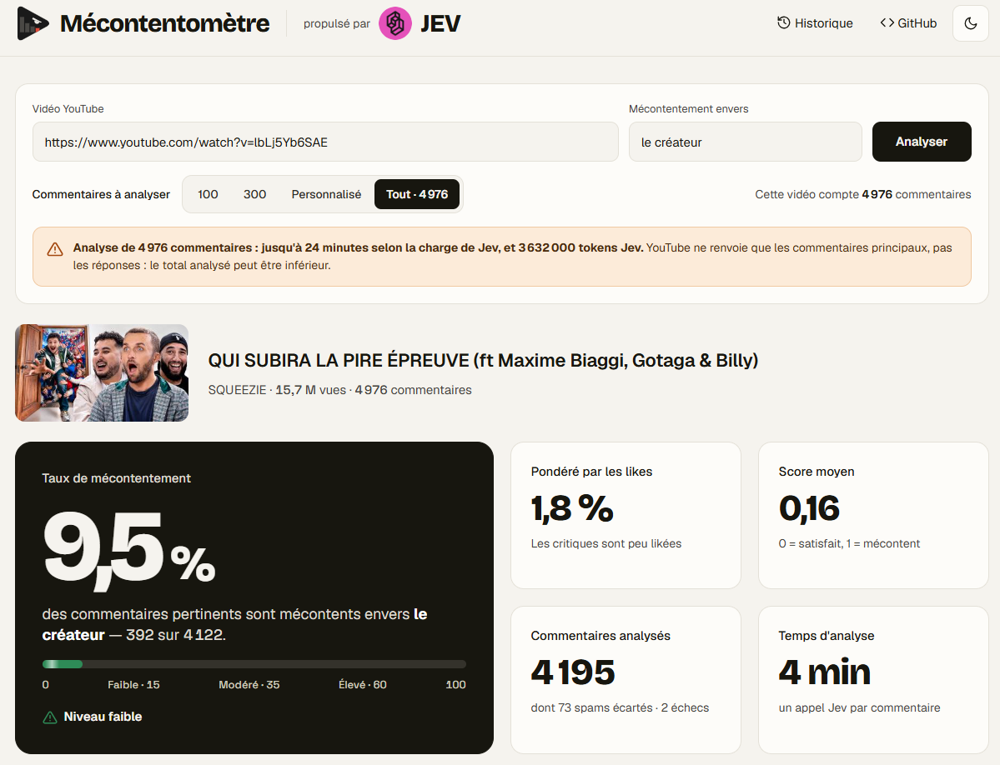
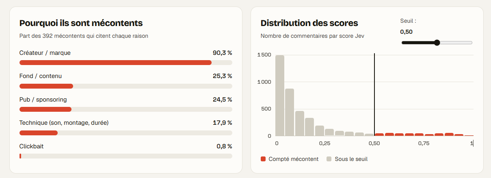

<p align="center">
  
</p>

<h1 align="center">Mécontentomètre</h1>

<p align="center">
  <b>Quel pourcentage des commentaires d'une vidéo YouTube est mécontent, et pourquoi ?</b><br>
  Propulsé par <a href="https://docs.typesafe.ai">Jev</a>, le modèle de décision de TypeSafe.
</p>

<p align="center">
  
</p>

Récupère les commentaires d'une vidéo (API YouTube Data v3), fait noter chacun par Jev,
puis agrège :

- % de commentaires mécontents (brut et pondéré par les likes), spam exclu
- raisons du mécontentement : comportement/valeurs, fond, pub, clickbait, technique
- distribution des scores et liste des commentaires, filtrable et triable

<p align="center">
  
</p>

## Dashboard web

```bash
python3 server.py          # puis ouvrir http://127.0.0.1:8000
```

Colle une URL : l'app affiche aussitôt le nombre de commentaires de la vidéo. Choisis 100, 300,
un nombre personnalisé (plafonné à ce total) ou « Tout » (avec une estimation du temps et des
tokens). La progression s'affiche en direct, puis le dashboard montre le % de mécontents (brut et
pondéré par likes), les raisons, la distribution des scores avec un seuil réglable, et la liste
des commentaires filtrable, triable par mécontentement ou likes dans les deux sens.
Thème clair et sombre, responsive. Les clés restent côté serveur ; chaque analyse est
enregistrée dans `runs/`.

## Ligne de commande

```bash
export Youtube_V3=...        # clé YouTube Data v3
export TYPESAFE_API_KEY=...  # clé Jev
python3 jev_comments.py "https://www.youtube.com/watch?v=BGY647T1FKo" --target "Apple" --max 300
```

Options : `--target` (contre qui mesurer le mécontentement, défaut : la vidéo ou son créateur),
`--max` (nombre de commentaires, défaut 500), `--workers` (parallélisme Jev), `--json` (export détaillé).

Aucune dépendance : Python 3 standard uniquement.

## Structure de la requête Jev

Chaque commentaire est envoyé avec le contexte de la vidéo (titre, chaîne, premier paragraphe
de la description) dans le `state`, et les questions demandent de juger uniquement le commentaire :

```
state: YouTube video "<titre>" by <chaîne>.
       Video summary: <résumé>

       Comment: <commentaire>
```

`eval/compare_prompts.py` compare plusieurs structures sur un jeu étiqueté à la main
(`eval/apple_ipad_crush.json`, 38 commentaires surtout ambigus) :

| Variante | Exactitude | AUC |
|---|---|---|
| Commentaire seul | 79 % | 0,90 |
| + titre | 87 % | 0,98 |
| **+ titre + résumé (retenu)** | **95-97 %** | **0,98** |
| Résumé dans les instructions | 84-89 % | 0,95 |

`--no-context` désactive le contexte en ligne de commande.

Le résumé n'est gardé que si Jev juge qu'un paragraphe de la description décrit vraiment la
vidéo : les descriptions remplies de liens, de matériel ou de FAQ sont ignorées (titre seul).

## Limites connues

- YouTube ne renvoie qu'environ 1 000 commentaires triés par pertinence : au-delà, l'app
  complète avec les plus récents. Les réponses aux commentaires ne sont pas analysées.
- La latence de Jev varie beaucoup (0,3 à 15 s par appel) : les appels lents sont relancés
  et 32 requêtes tournent en parallèle.

## Déploiement gratuit (Render)

1. Sur [render.com](https://render.com), **New → Blueprint** et choisir ce repo (branche avec `render.yaml`).
2. Renseigner les variables demandées : `TYPESAFE_API_KEY`, `Youtube_V3` et **`APP_PASSWORD`**
   (obligatoire en public, sinon n'importe qui consomme tes quotas).
3. Ouvrir l'URL `https://<nom>.onrender.com` : le navigateur demande un identifiant
   (n'importe lequel) et le mot de passe.

Offre gratuite : le service s'endort après 15 min sans visite (environ 1 min pour se réveiller)
et le disque n'est pas persistant, donc l'historique `runs/` est perdu à chaque redémarrage.
